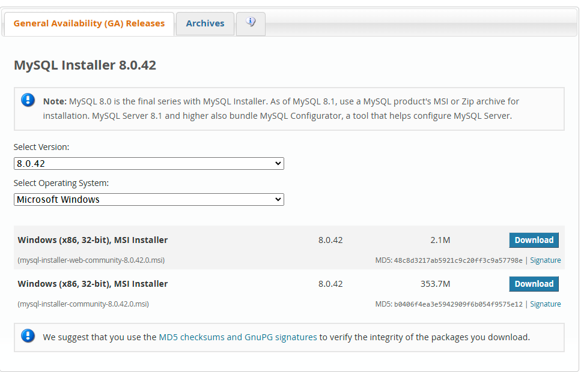
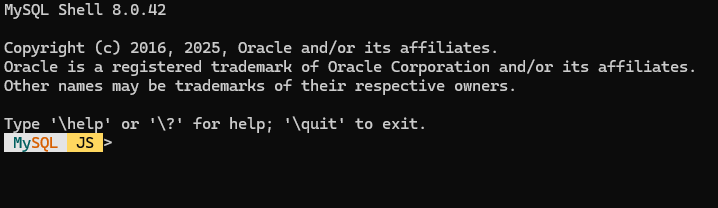
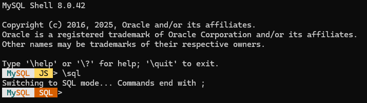
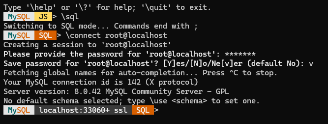
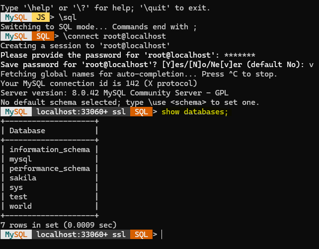
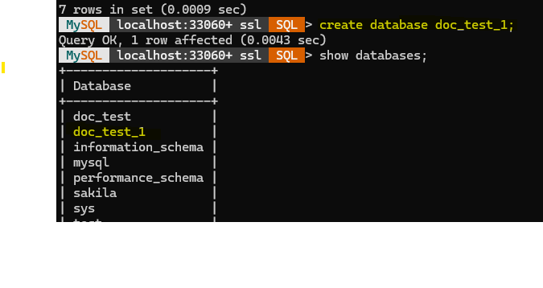
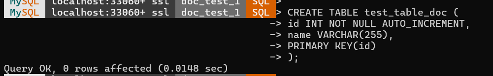

## Configuring a basic table in the MySQL Database.

You need to download the MySQL Workbench along with MySQL server. To make things simple, you can download an installer from [here](https://dev.mysql.com/downloads/installer/). Download and install the application with the default settings. 
**Note:** In this scenario, we are going to be using MySQL Installer 8.0.42. 

Once installed, you would have MySQL Workbench as a GUI that you can use to work with the databases and tables or you can use the mysql shell to work with the databases. In this tutorial, we would be using the mysql shell. 
Hit Windows + R to open the Run window and type **mysqlsh**. A window like below will open.



If the shell opens in the **JS** version then you need to change it to run on the SQL mode. For that you need to run this command. 
```bash
\sql
```
Post this, you should be able to see that the MySQL shell is running in the SQL mode. 



Now that you have MySQL shell running in SQL mode. You can then move forward to create database and tables and interact with the same.

### Connect to the Database Server
To connect to the database server, run this command. 
```bash
\connect root@localhost
```
This command is used to connect to the database server running in your **localhost** using the user **root**. Once entered, you would be asked to enter the root password. Enter the password and then you would be interacting with the database server. 



### See the databases available in the server
To see the databases available in the server, use this command.
```bash
show databases;
```


### Create a database in the server
To create a database, use this command. 
```bash
create database database_name;
```


### Create a table in the database
To create a table in the database, you would have to first use the database. Follow the below example and commands. 

```bash
use database_name
```


These messages below the Use commands are expected. Don’t worry. 

#### Create Table

Use the create command to create the table. We are creating a simple table here. 

```sql
CREATE TABLE table_name (columns and rules);
```



Once the table is created, you can use the insert commands and others as required. 

### References and Extra Material 
Read about MySQL Shell [here](https://dev.mysql.com/doc/refman/8.4/en/mysql-shell-tutorial-javascript-shell.html).